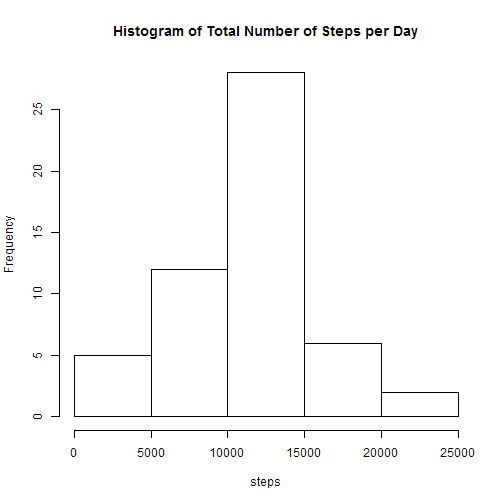
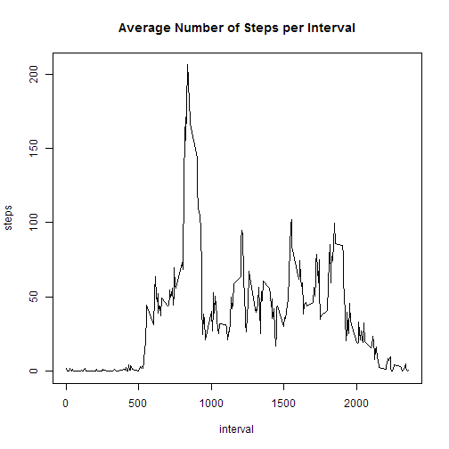
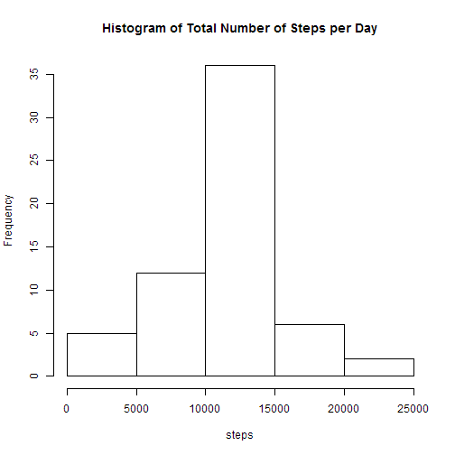
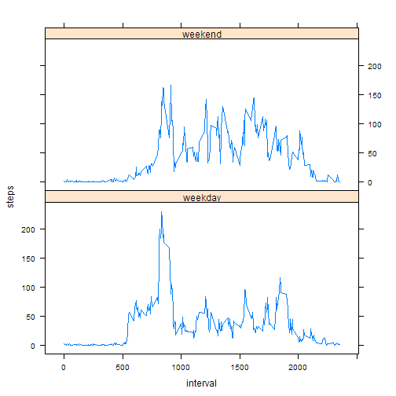

## Loading and preprocessing the data


```r
activity <- read.csv(unzip("activity.zip","activity.csv"),header=TRUE)
```


## What is mean total number of steps taken per day?

```r
totalsteps <- aggregate(steps ~ date, data=activity, sum)
with(totalsteps, hist(steps, main="Histogram of Total Number of Steps per Day"))
```

 

Mean total number of steps per day:

```r
mean(totalsteps$steps)
```

```
## [1] 10766.19
```

Median total number of steps per day:

```r
median(totalsteps$steps)
```

```
## [1] 10765
```


## What is the average daily activity pattern?

```r
meansinterval <- aggregate(steps ~ interval, data=activity, mean)
plot(meansinterval,type="l",main="Average Number of Steps per Interval")
```

 

Interval with average maximum number of steps:

```r
meansinterval[which(meansinterval$steps==max(meansinterval$steps)),"interval"]
```

```
## [1] 835
```


## Imputing missing values
Total number of missing values in the dataset:


```r
sum(is.na(activity$steps))
```

```
## [1] 2304
```

Fill in all of the missing values in the dataset with the mean for that 5-minute interval. 
Using the table of average steps for each interval as a look up table.


```r
imputeactivity <- activity
imputeactivity$impute <- 
    meansinterval$steps[match(imputeactivity$interval, meansinterval$interval)]
imputeactivity$steps[which(is.na(imputeactivity$steps))] <- 
    imputeactivity$impute[which(is.na(imputeactivity$steps))]
```

Plot the histogram of the total number of steps taken each day using the new dataset with imputed steps data  

```r
imputetotalsteps <- aggregate(steps ~ date, data=imputeactivity, sum)
with(imputetotalsteps, hist(steps, main="Histogram of Total Number of Steps per Day"))
```

 

Mean total number of steps per day:

```r
mean(imputetotalsteps$steps)
```

```
## [1] 10766.19
```

Median total number of steps per day:

```r
median(imputetotalsteps$steps)
```

```
## [1] 10766.19
```
The histogram and median differ from the estimates from the first part of the assignment. But the mean is the same.
The original dataset was missing data for entire dates. So the impact of imputing missing data on the estimates of the total daily number of steps is to add the average number of steps to dates that previously were missing data. This causes the middle bar of the histogram to increase in height and the median to increase. Since additional dates were added with the previous mean steps the mean remains unchanged.

## Are there differences in activity patterns between weekdays and weekends?
Create a new factor variable in the dataset with two levels – weekday and weekend indicating whether a given date is a weekday or weekend day

```r
imputeactivity$weekday <- ifelse (weekdays(as.Date(imputeactivity$date)) 
                                  %in% c("Saturday","Sunday"), "weekend", "weekday")
meansintervalimpute <- aggregate(steps ~ interval+weekday, data=imputeactivity, mean)
```

A panel plot containing a time series plot of the interval and the average number of steps taken, averaged across all weekday days or weekend days.

```r
library(lattice)
xyplot(steps ~ interval | weekday, data=meansintervalimpute , type="l", layout = c(1, 2))
```

 
